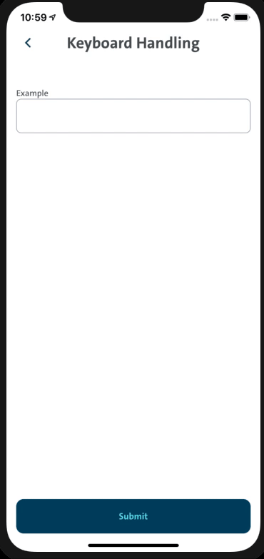
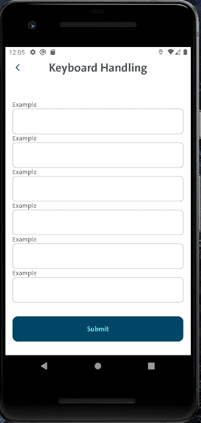
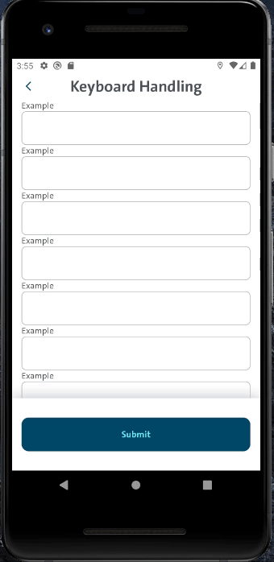

# Working with keyboard in react-native

- [Keyboard handling](#keyboard-handling)
- [Examples](#examples)
- [Keyboard over the content up](#keyboard-over-the-content-up)
- [Keyboard pushes the content](#keyboard-pushes-the-content)
- [Scroll to active input](#scroll-to-active-input)
- [Scroll to active input android with scroll and sticky button](#scroll-to-active-input-android-with-scroll-and-sticky-button)

There is very little possibility that we will be working on an application that will not have any kind of form to collect user data. The virtual keyboard is displayed when the user has to type something. In react-native you will see the keyboard popping up while entering input to the TextInput component. And that is the reason why working with the keyboard in react-native is crucial to provide awesome UX to the end-users.

A difference appears in keyboard behavior between android and iOS platforms. On iOS, the keyboard behavior is handled completely internally by the platform and there is no custom configuration allowed. On the other hand, on android there is room for custom configuration.

You can check details of all possible configurations on [Android Developer Site](https://developer.android.com/guide/topics/manifest/activity-element) in section `android:windowSoftInputMode`.

To add a configuration for the keyboard on android just open `android/app/src/main/AndroidManifest.xml` and find the `activity` element and change the `android:windowSoftInputMode` property per your need.

From our experience so far, we found that `android:windowSoftInputMode="adjustPan"` is a setting which provided us the most desirable and configurable behavior of the keyboard. Another value for `android:windowSoftInputMode` property which is valuable to set is `"adjustResize"`.

From the Android Developer Site link

`"adjustResize"`

"The activity's main window is always resized to make room for the soft keyboard on screen".

Meaning that the keyboard will always push the content on the screen up.

`"adjustPan"`

"The activity's main window is not resized to make room for the soft keyboard. Rather, the contents of the window are automatically panned so that the current focus is never obscured by the keyboard and users can always see what they are typing".

Meaning that the keyboard will not push the content on the screen up, but it will go over the content on the screen.

Both of these cases will be covered in the examples section.

## Examples

In this section, the most usual cases of keyboard handling will be presented. There are four of them:

- keyboard over the content,
- Keyboard pushes the content,
- Scroll to active input,
- Scroll to active input android with scroll and sticky button.

The prerequisite for the examples is setting`android:windowSoftInputMode` to `"adjustPan"`.

### Keyboard over the content

This is the default behavior on iOS and on android if you set `android:windowSoftInputMode` to `"adjustPan"`.

|  |
| :----------------------------------: |
|      Keyboard over the content       |

```
import React from 'react';
import { CFButton, CFTextField, ScreenHeader } from 'components';
import { CFText } from 'components/CFText';
import { Keyboard, StyleSheet, View } from 'react-native';

export const KeyboardHandling = () => {
  return (
    <>
      <ScreenHeader screenTitle="Keyboard Handling" />
      <View
        style={styles.container}
      >
        <CFTextField
          primaryLabel="Example"
          autoFocus={false}
          returnKeyLabel="done"
          returnKeyType="done"
          onSubmitEditing={() => Keyboard.dismiss()}
        />
        <CFButton>Submit</CFButton>
      </View>
    </>
  );
};

const styles = StyleSheet.create({
  container: {
    flex: 1,
    paddingHorizontal: 16,
    paddingTop: 50,
    paddingBottom: 30,
    justifyContent: 'space-between',
  },
});
```

### Keyboard pushes the content up

To achieve this behavior on iOS and android you will have to use [KeyboardAvoidingView](https://reactnative.dev/docs/keyboardavoidingview) component from react-native. From official documentation: _"it is a component to solve the common problem of views that need to move out of the way of the virtual keyboard. It can automatically adjust either its height, position, or bottom padding based on the keyboard height"_.

This component takes a `behavior` prop and both iOS and android platforms interact with this prop differently and setting it is recommended.

In the example below for iOS the value for this prop is `'padding`, which means that s single `<View>` component is returned where a paddingBottom style is applied to the height of the keyboard if the keyboard is present and for android is `'height`, which means that a `<View>` component is returned with styling that attempts to set a static height to the view that is either the screen height or the screen height minus the keyboard when the keyboard is present.

|  |
| :------------------------------------: |
|     Keyboard pushes the content up     |

```
import React from 'react';
import { CFButton, CFTextField, ScreenHeader } from 'components';
import {
  Keyboard,
  KeyboardAvoidingView,
  Platform,
  StyleSheet,
  View,
} from 'react-native';

export const KeyboardHandling = () => {
  return (
    <>
      <ScreenHeader screenTitle="Keyboard Handling" />
      <KeyboardAvoidingView
        behavior={Platform.OS === 'ios' ? 'padding' : 'height'}
        style={styles.keyboardView}
      >
        <View
          style={styles.container}
        >
          <CFTextField
            primaryLabel="Example"
            autoFocus={false}
            returnKeyLabel="done"
            returnKeyType="done"
            onSubmitEditing={() => Keyboard.dismiss()}
          />
          <CFButton>Submit</CFButton>
        </View>
      </KeyboardAvoidingView>
    </>
  );
};

const styles = StyleSheet.create({
  keyboardView: { flex: 1 },
  container: {
    flex: 1,
    paddingHorizontal: 16,
    paddingTop: 50,
    paddingBottom: 30,
    justifyContent: 'space-between',
  },
});
```

### Scroll to active input

This example is when you have a case where you want to have the input field always visible and not to be covered by the keyboard to see what is user typing. So the desired behavior is to scroll the content up until the focused input field is visible and it is just above the keyboard.

To achieve this behavior you have to use `KeyboardAwareScrollView` component from [react-native-keyboard-aware-scroll-view](https://github.com/APSL/react-native-keyboard-aware-scroll-view) library. This component is a `ScrollView` component that handles keyboard appearance and automatically scrolls to focused `TextInput`.

Again, there are differences in the implementation between platforms whose are the following:

- `extraScrollHeight` -> for iOS you have to add bottom offset which would be the sum of container padding and the height of the button in this case. For android there is no need for offset since android is aware of the elements and spacing. This kind of keyboard handling is implemented in the android platform itself,
- `extraHeight` -> for android `30` is used as a value to move the content above the keyboard and give additional space between keyboard and input field. For iOS it is `75` which is the default value for this prop,
- on android the whole content is pushed up, whether it is rendered in KeyboardAwareScrollView component or not. The solution would be to apply the color to the status bar the same background color the screen has and in that way, the status bar will have the background color and the content will be presented as it scrolls under the status bar. This is not an issue on iOS since only the content rendered in the KeyboardAwareScrollView component scrolls.

|  |  |
| :------------------------------------------------: | :--------------------------------------------: |
|           Scroll to active input android           |           Scroll to active input iOS           |

```
import React, { Fragment } from 'react';
import { CFButton, CFTextField, ScreenHeader } from 'components';
import { range } from 'lodash';
import {
  Keyboard,
  KeyboardAvoidingView,
  Platform,
  StatusBar,
  StyleSheet,
  View,
} from 'react-native';
import { KeyboardAwareScrollView } from 'react-native-keyboard-aware-scroll-view';

const IOS_KEYBOARD_SCROLL_OFFSET = 86;
const ANDROID_KEYBOARD_SCROLL_OFFSET = 0;

export const KeyboardHandling = () => {
  return (
    <>
      <StatusBar backgroundColor={primaryBackgroundColor} />
      <ScreenHeader screenTitle="Keyboard Handling" />
      <View
        style={styles.container}
      >
        <KeyboardAwareScrollView
          bounces={false}
          enableOnAndroid
          extraScrollHeight={
            Platform.OS === 'ios'
              ? IOS_KEYBOARD_SCROLL_OFFSET
              : ANDROID_KEYBOARD_SCROLL_OFFSET
          }
          scrollEnabled={false}
          showsVerticalScrollIndicator={false}
          extraHeight={Platform.OS === 'ios' ? 75 : 30}
          style={styles.keyboardView}
        >
          {range(0, 8).map((i) => (
            <Fragment key={i}>
              <CFTextField
                primaryLabel="Example"
                autoFocus={false}
                returnKeyLabel="done"
                returnKeyType="done"
                onSubmitEditing={() => Keyboard.dismiss()}
              />
            </Fragment>
          ))}
        </KeyboardAwareScrollView>
        <CFButton>Submit</CFButton>
      </View>
    </>
  );
};

const styles = StyleSheet.create({
  keyboardView: { flex: 1 },
  container: {
    flex: 1,
    paddingHorizontal: 16,
    paddingTop: 50,
    paddingBottom: 30,
  },
});
```

### Scroll to active input android with scroll and sticky button

This example is similar to the previous one. The only difference is here you have a sticky button to the bottom and the list of the input fields which go behind the button (the same approach would be if you have some content above and the input fields to the bottom of the list).

Compared to the previous example the values for `extraScrollHeight` and `extraHeight` are changed due to the difference in layout.

Another difference is that on iSO we have to position the button absolutely and offset `ScrollView` for button height so scroll can be achieved.

|  |  |
| :------------------------------------------------------------------------------: | :--------------------------------------------------------------------------: |
|       Scroll to active input android with scroll and sticky button android       |       Scroll to active input android with scroll and sticky button ios       |

```import React, { Fragment } from 'react';
import { useKeyboard } from '@react-native-community/hooks';
import { CFButton, CFTextField, ScreenHeader } from 'components';
import { range } from 'lodash';
import { Keyboard, Platform, StatusBar, StyleSheet, View } from 'react-native';
import { KeyboardAwareScrollView } from 'react-native-keyboard-aware-scroll-view';

const IOS_KEYBOARD_SCROLL_OFFSET = 16;
const ANDROID_KEYBOARD_SCROLL_OFFSET = 32;

export const KeyboardHandling = () => {
  const keyboard = useKeyboard();
  return (
    <>
      <StatusBar backgroundColor={primaryBackgroundColor} />
      {Platform.OS === 'ios' ? (
        <ScreenHeader screenTitle="Keyboard Handling" />
      ) : null}
      <View style={styles.root}>
        <View
          style={[
            styles.scrollContainer,
            {
              backgroundColor: primaryBackgroundColor,
            },
          ]}
        >
          <KeyboardAwareScrollView
            bounces={false}
            enableOnAndroid
            extraScrollHeight={
              Platform.OS === 'ios'
                ? IOS_KEYBOARD_SCROLL_OFFSET
                : ANDROID_KEYBOARD_SCROLL_OFFSET
            }
            showsVerticalScrollIndicator={false}
            extraHeight={Platform.OS === 'ios' ? 75 : 0}
            contentContainerStyle={styles.scrollContainerContent}
            scrollEnabled={!keyboard.keyboardShown}
          >
            {Platform.OS === 'android' ? (
              <ScreenHeader screenTitle="Keyboard Handling" />
            ) : null}
            <View style={styles.innerContent}>
              {range(0, 10).map((i) => (
                <Fragment key={i}>
                  <CFTextField
                    primaryLabel="Example"
                    autoFocus={false}
                    returnKeyLabel="done"
                    returnKeyType="done"
                    onSubmitEditing={() => Keyboard.dismiss()}
                  />
                </Fragment>
              ))}
            </View>
          </KeyboardAwareScrollView>
          <View
            style={[
              styles.button,
              Platform.OS === 'ios' && styles.iosButton
            ]}
          >
            <CFButton >Submit</CFButton>
          </View>
        </View>
      </View>
    </>
  );
};

const styles = StyleSheet.create({
  root: {
    flex: 1,
    justifyContent: 'space-between',
  },
  scrollContainer: { flex: 1 },
  scrollContainerContent: {
    flexGrow: 1,
    paddingBottom: Platform.select({
      ios: 188,
    }),
    justifyContent: 'flex-end',
  },
  innerContent: {
    justifyContent: 'flex-end',
    flex: 1,
    paddingHorizontal: 16,
  },
  button: {
    paddingVertical: 32,
    paddingHorizontal: 16,
  },
  iosButton: {
    position: 'absolute',
    bottom: 0,
    left: 0,
    right: 0,
  },
});
`
```

And that's it. These ones are the most used ways to interact with the virtual keyboard in react-native. And those can be applied to form with any kind of `TextInput` component. There are no restrictions to use just the one from react-native, it can be applied to `TextInput` components from any other library, as well.
